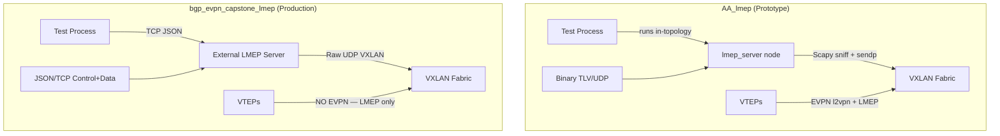

# LMEP Implementation Comparison: `AA_lmep` vs `bgp_evpn_capstone_lmep`

## Summary

The two folders represent **successive generations** of the same LMEP concept. `AA_lmep` is an early prototype with an in-topology server using Scapy and a binary TLV protocol. `bgp_evpn_capstone_lmep` is the production-grade rewrite with an external standalone server, JSON-over-TCP control/data planes, macvlan-based host simulation, and comprehensive measurement instrumentation.

---

## 1. Topology

| Dimension | `AA_lmep` | `bgp_evpn_capstone_lmep` |
|---|---|---|
| Spines | 2 (spine1, spine2) | 2 (spine1, spine2) |
| VTEPs | **4** (vtep1–vtep4) | **3** (vtep1–vtep3) |
| Hosts | **4** (host1–host4) | **3** (host1–host3) |
| LMEP server node | `lmep_server` — runs **inside** the Topotest topology as a router node | **None** — server runs externally on the host |
| Topology file | Built programmatically only | Also has a `topology.dot` visualization |
| Extra nodes | `vtep4`, `host4`, `lmep_server` | None |

> [!NOTE]
> `AA_lmep` has a `vtep4` and `host4` directory, but their config files are empty (1 byte each), suggesting they were placeholders never fully wired up. The `lmep_server` is added as a Topotest router with an IP address and a route, coupling the LMEP daemon to the test network namespace.

---

## 2. LMEP Server Architecture

This is the **largest and most fundamental difference** between the two implementations.

### `AA_lmep` — [lmep_server.py](file:///Users/nathantam/Projects/capstone/tests/topotests/AA_lmep/lmep_server.py) (117 lines)

- **Protocol**: Custom **binary TLV over UDP** (port 4789, same as VXLAN).
- **Dependency**: Uses **Scapy** (`scapy.all`) for packet sniffing, crafting, and forwarding.
- **Registration**: Parses binary TLV fields (`0x01`=MAC, `0x04`=VTEP_IP) from UDP datagrams.
- **Forwarding**: Sniffs raw packets on `eth0` with Scapy, performs MAC lookup, wraps in VXLAN using Scapy `Ether/IP/UDP/Raw` layers, and sends via `sendp()`.
- **Data store**: `defaultdict(dict)` keyed by MAC, storing `vtep_ip`, `timestamp`, `vni`.
- **Deployment**: Runs **inside** the Topotest namespace as a background process (`python3 /root/lmep_protocol.py`).
- **Limitations**: VNI is hardcoded to `100`, no structured response protocol, no dump/lookup API, requires root and Scapy in the test namespace.

### `bgp_evpn_capstone_lmep` — [lmep_server.py](file:///Users/nathantam/Projects/capstone/tests/topotests/bgp_evpn_capstone_lmep/lmep_server.py) (302 lines)

- **Protocol**: **JSON over TCP** with two dedicated ports (control=6000, data=6001).
- **Dependency**: **Standard library only** — no Scapy, no external packages.
- **Registration**: JSON payloads with `action: register/lookup/dump` on the control port. Server responds with structured JSON including the full entry and registration count.
- **Forwarding**: Data port accepts `action: forward` requests with dst/src MAC and payload. Server does MAC lookup, builds raw Ethernet + VXLAN headers with `struct.pack`, and sends via a UDP socket.
- **Data store**: `LMEPStore` dataclass with `LMEPEntry` objects, thread-safe with `threading.Lock`, tracks registration count.
- **Deployment**: Runs **externally** on the host machine (e.g., in a tmux session), test connects to `127.0.0.1`.
- **CLI**: Full `argparse` interface for `--bind-host`, `--control-port`, `--data-port`, `--vxlan-port`, `--outer-src-ip`, `--log-level`.
- **Extras**: Proper logging, graceful shutdown via `KeyboardInterrupt`, `normalize_ethertype()` with hex/decimal support, base64/hex/text payload options.

> [!IMPORTANT]
> The capstone version completely replaces the Scapy-based packet sniffing approach with a deterministic request-response model. This makes the server testable, inspectable (via `dump`), and independent from the test topology's network namespace.

---

## 3. Test Harness

### `AA_lmep` — [01_base_case_host_manipulation.py](file:///Users/nathantam/Projects/capstone/tests/topotests/AA_lmep/01_base_case_host_manipulation.py) (480 lines)

- **Host movement**: Moves hosts by changing IP/MAC on the `vtepbond` interface. Directly reassigns the IP (`ip addr del/add`) and MAC from one host to another.
- **Verification**: Uses `show evpn mac vni 1000 json` on vtep1 to confirm MAC type changed (local ↔ remote) via `topotest.json_cmp`.
- **Observability**: Background ping from host3 with timestamps; event timestamps logged to ping output.
- **LMEP test**: `test_lmep_registration` — has a **typo bug** (`tge` instead of `tgen` on line 291). Simply checks that "Registered MAC" appears in the LMEP daemon log.
- **LMEP sending**: `send_lmep_registration()` builds binary TLV and shells out a Python one-liner via `host.run()` to send a UDP datagram.
- **Measurement**: None — no packet captures, no BGP traffic counting.

### `bgp_evpn_capstone_lmep` — [test_evpn_capstone_lmep.py](file:///Users/nathantam/Projects/capstone/tests/topotests/bgp_evpn_capstone_lmep/test_evpn_capstone_lmep.py) (762 lines)

- **Host movement**: Uses **macvlan interfaces** (`dummy1`, `dummy2`, etc.) on top of `vtepbond` to simulate multiple endpoints per host. Moves dummies between hosts by deleting and recreating the macvlan interface.
- **Verification**: After moving, sends a `register` to the LMEP server and verifies the response contains `ok: true` and the correct `vtep_ip`. Then sends a `forward` request and asserts the `resolved_vtep` matches.
- **Observability**: 
  - Background pings per host with separate log files
  - `tcpdump` capture on LMEP control port
  - BGP captures (`tcpdump port 179`) on spine1, vtep1, vtep2, vtep3
  - FDB monitor (`bridge monitor fdb`) with millisecond timestamps
  - `tshark` MP_REACH_NLRI/MP_UNREACH_NLRI counting
- **Scalability**: Configurable `number_of_dummy` variable to scale endpoint count. Dummy-to-host mapping distributes dummies round-robin across hosts.
- **Measurement**: Full packet-count reporting at teardown — per-node BGP packet totals and NLRI distribution.
- **Robustness**: LMEP connectivity probe at test start with actionable error message. Memory leak report suppression during teardown.

---

## 4. BGP / EVPN Configuration

| Aspect | `AA_lmep` | `bgp_evpn_capstone_lmep` |
|---|---|---|
| VTEP `l2vpn evpn` address family | ✅ Enabled with `advertise-all-vni` and `advertise-svi-ip` | ❌ **Completely removed** |
| Spine `l2vpn evpn` activation | ✅ `neighbor TRANSIT_OVERLAY activate` under `l2vpn evpn` | ❌ **Removed** — spines don't carry EVPN routes |
| Spine neighbor count | 4 peers (10.1.1.2, 10.1.2.2, 10.1.3.2, **10.1.4.2**) | 4 peers (same — likely has a stale 4th peer from vtep4 removal) |

> [!WARNING]
> The capstone VTEP configs have **no `l2vpn evpn` address family at all**. This is the most architecturally significant change — it means EVPN MAC/IP advertisement is **intentionally disabled** because LMEP is supposed to replace that function entirely. The AA_lmep version still relies on EVPN for MAC learning alongside the LMEP server.

---

## 5. Network Configuration Details

| Detail | `AA_lmep` | `bgp_evpn_capstone_lmep` |
|---|---|---|
| SVI subnet mask | `/24` | `/16` |
| SVI IPs | `192.168.0.11/12/13` | `192.168.0.251/252/253` |
| Anycast gateway | `192.168.0.1/24` | `192.168.0.250/16` |
| Host IP scheme | `192.168.0.{id}0/24` (e.g., `192.168.0.10`) | `192.168.0.24{id}/16` (e.g., `192.168.0.241`) |
| Dummy/macvlan interfaces | ❌ Not used | ✅ Used to simulate multiple endpoints per host |
| Dummy MAC scheme | N/A | `00:00:{octet3}:00:ff:{octet6}` based on dummy ID |

The `/16` subnets in the capstone version allow a much larger address space for dummy endpoints, accommodating the scaled testing approach.

---

## 6. Documentation & Project Maturity

| Aspect | `AA_lmep` | `bgp_evpn_capstone_lmep` |
|---|---|---|
| README | ❌ None | ✅ Comprehensive [README.md](file:///Users/nathantam/Projects/capstone/tests/topotests/bgp_evpn_capstone_lmep/README.md) |
| Protocol spec | ❌ None | ✅ [LMEP Standard.md](file:///Users/nathantam/Projects/capstone/tests/topotests/bgp_evpn_capstone_lmep/LMEP%20Standard.md) (covers base LMEP + H-LMEP) |
| `__init__.py` | ❌ Missing | ✅ Present (proper Python package) |
| Topology visualization | ❌ None | ✅ `topology.dot` |
| Known bugs | `tge` typo on L291, `lmep_server` node referenced but LMEP test incomplete | None apparent |
| Commented-out code | Moderate | Heavy (many debugging artifacts) |

---

## 7. Key Architectural Differences at a Glance

## 8. Bugs & Issues Found

### `AA_lmep`
1. **Typo on line 291**: `tge.gears["vtep1"]` should be `tgen.gears["vtep1"]` — this would cause `test_lmep_registration` to crash with a `NameError`.
2. **Duplicate `stop_background_ping` call** at lines 431 and 434 in `test_host_movement`.
3. **Undefined variables**: `LMEP_SERVER_IP` and `LMEP_SERVER_PORT` used in `send_lmep_registration()` (line 313) are never defined.

### `bgp_evpn_capstone_lmep`
1. **Stale spine neighbor**: `spine1/evpn.conf` still peers with `10.1.4.2` (vtep4's address) but vtep4 doesn't exist in this topology.
2. **`import pdb`** left in the test file (line 19) — debug import should be removed for production.
